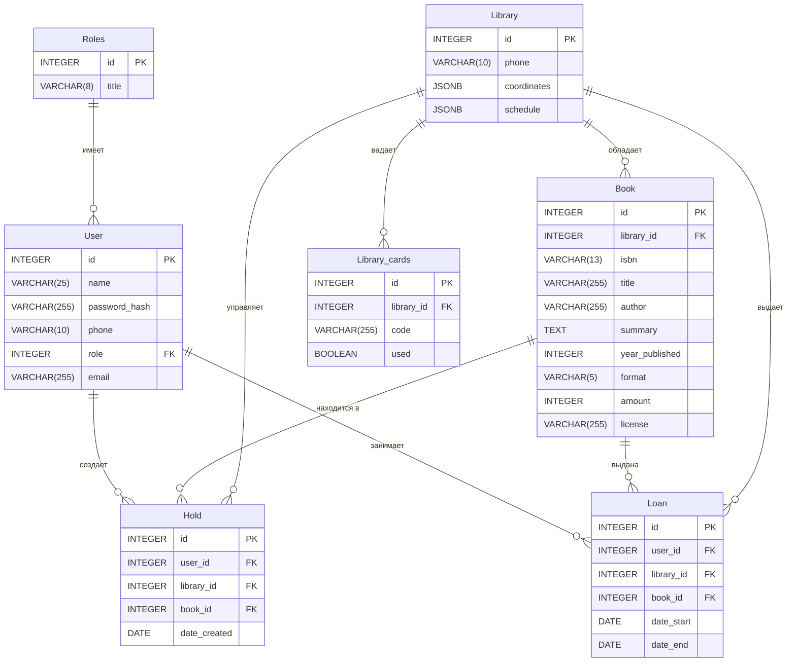

# ER диаграмма

## Связи

| Связь | Тип | Описание |
|----|----|----|
| Roles → User | 1:N | Множество пользователей могу принадлежать одной роли |
| Library → Book | 1:N | Одна библиотека хранит много книг |
| Library → Library_cards | 1:N | Одна библиотека может выпустить множество читательских билетов. |
| User → Hold | 1:N | Один пользователь может вставать в очередь на много книг |
| Book → Hold | 1:N | На одну книгу могут стоять в очереди много пользователей |
| Library → Hold | 1:N | Очередь относится к конкретной библиотеке |
| User → Loan | 1:N | Пользователь может брать много книг |
| Book → Loan | 1:N | Одна книга может выдаваться много раз со временем |
| Library → Loan | 1:N | Выдача всегда происходит через конкретную библиотеку |

## Вопросы для самопроверки

1. Чем связь 1:N отличается от M:N? Приведите пример каждой из вашего проекта.

В случае 1:N одной записи из таблицы A соответствует много записей из таблицы B,
но каждая запись B принадлежит только одной записи A. А в случае M:N многие записи из таблицы A могут быть связаны со многими записями из таблицы B.
Без таблицы Loan связь выглядела бы так: User <-- M:N --> Book, но SQL не хранит M:N напрямую, поэтому создаётся User -- 1:N --> Loan <-- N:1 -- Book.

2. Почему связь M:N нельзя реализовать двумя таблицами? Зачем нужна промежуточная?

Потому что sql  хранит только одно значение в ячейке, а не список (есть JSONB но он не для этого). Промежуточная таюлица нужна для преобразования M:N в две связи типа 1:N.

3. Что будет, если удалить запись, на которую ссылается FK? (Подумайте, мы разберём это на лекции)

Если удалить запись, на которую ссылается внешний ключ (FK, Foreign Key), поведение зависит от настроек ограничения ON DELETE.

4. Может ли FK быть NULL? Когда это полезно?

Может, если связь необязательная.
