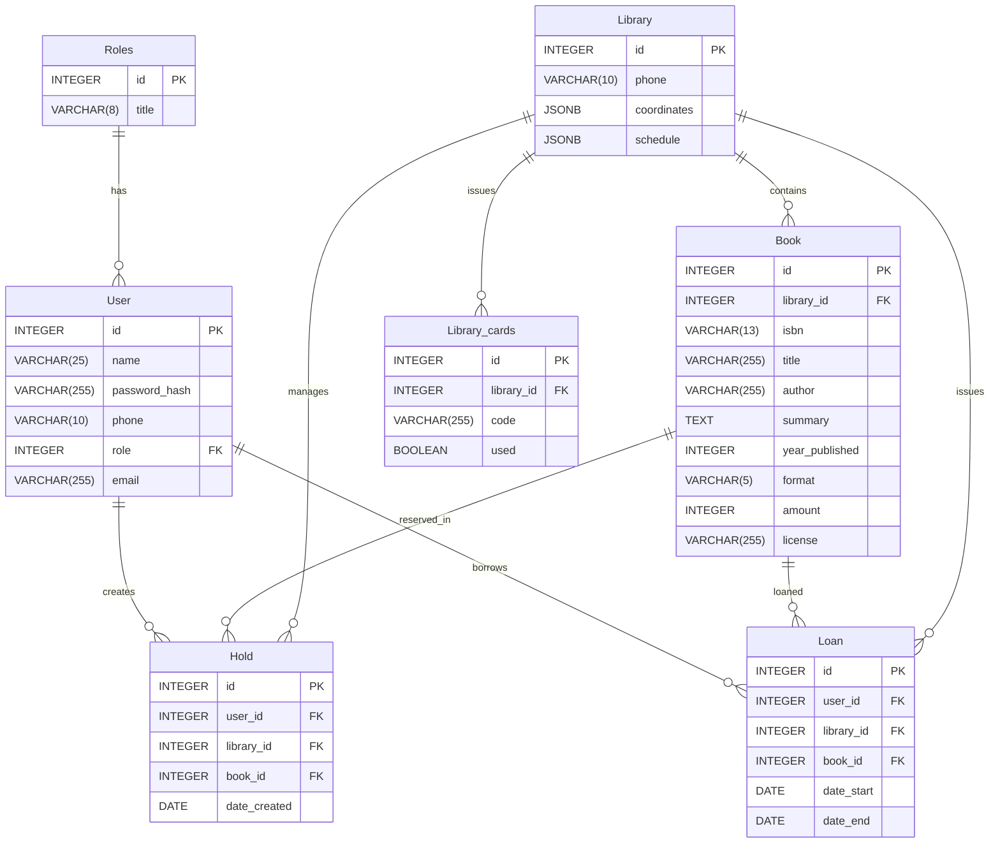

```mermaid
erDiagram

    User {
        INTEGER id PK
        VARCHAR(25) name
        VARCHAR(255) password_hash
        VARCHAR(10) phone
        INTEGER role FK
        VARCHAR(255) email
    }

    Roles {
        INTEGER id PK
        VARCHAR(8) title
    }

    Library {
        INTEGER id PK
        VARCHAR(10) phone
        JSONB coordinates
        JSONB schedule
    }

    Book {
        INTEGER id PK
        INTEGER library_id FK
        VARCHAR(13) isbn
        VARCHAR(255) title
        VARCHAR(255) author
        TEXT summary
        INTEGER year_published
        VARCHAR(5) format
        INTEGER amount
        VARCHAR(255) license
    }

    Library_cards {
        INTEGER id PK
        INTEGER library_id FK
        VARCHAR(255) code
        BOOLEAN used
    }

    Hold {
        INTEGER id PK
        INTEGER user_id FK
        INTEGER library_id FK
        INTEGER book_id FK
        DATE date_created
    }

    Loan {
        INTEGER id PK
        INTEGER user_id FK
        INTEGER library_id FK
        INTEGER book_id FK
        DATE date_start
        DATE date_end
    }

    Roles ||--o{ User : "has"

    Library ||--o{ Book : "contains"

    Library ||--o{ Library_cards : "issues"

    User ||--o{ Hold : "creates"
    Book ||--o{ Hold : "reserved_in"
    Library ||--o{ Hold : "manages"

    User ||--o{ Loan : "borrows"
    Book ||--o{ Loan : "loaned"
    Library ||--o{ Loan : "issues"
```
